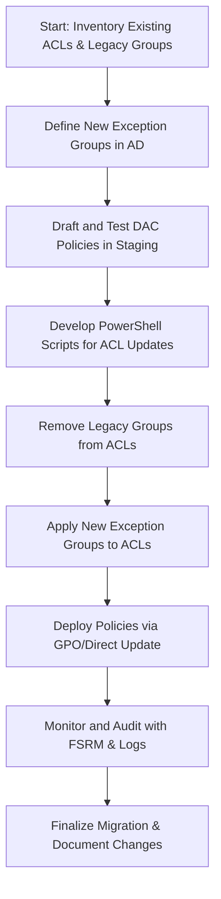

Below is the complete recommendation formatted in Markdown:

---

# Ideal Layout and Configuration for a 2x Node Windows Server Core Failover File Server Cluster

This document outlines the recommended architecture, layout, and configuration for a 2x node Windows Server Core failover file server cluster deployed on Dell VxRail with a VMware vSAN cluster. The solution is managed via Windows Admin Center (WAC) and is designed to migrate from an RBAC model with legacy security groups to a modern setup using Dynamic Access Control (DAC) and File Server Resource Manager (FSRM). Two new exception groups are introduced: one for administrative exceptions and one for temporary users (e.g., contractors or work placement).

---

## 1. Overall Architecture and Configuration

### Physical and Virtual Infrastructure

- **Dell VxRail Hardware**:  
  Provides the converged infrastructure, offering compute, networking, and storage resources.
  
- **VMware vSAN Cluster**:  
  Aggregates local disks across the VxRail nodes to create a resilient, shared datastore.
  
- **Virtual Machines on vSAN**:  
  Two VMs running Windows Server Core are deployed and configured as nodes in a failover cluster.
  
- **Windows Server Core Failover File Server Cluster**:  
  Configured for high availability of file shares, including:
  - Cluster validation and witness configuration.
  - Cluster Shared Volumes (CSV) hosted on the vSAN datastore.
  - File shares configured with Continuous Availability to ensure client transparency during failover.

### Management and Service Integration

- **Windows Admin Center (WAC)**:  
  Centralizes management of the cluster, providing a modern interface for:
  - Monitoring cluster health.
  - Managing cluster roles and failover configurations.
  - Integrating with Windows PowerShell for automation.

- **Dynamic Access Control (DAC)**:  
  Replaces static RBAC with security groups by enabling:
  - Claims-based authorization and centralized policy management.
  - File classification and auditing through Active Directory and Group Policy.

- **File Server Resource Manager (FSRM)**:  
  Provides additional control by enforcing quotas, file screening, and generating storage reports to complement DAC.

---

## 2. Architecture Diagram

Below is an example diagram illustrating the system layout and integration:

```mermaid
flowchart TD
    A[**Dell VxRail Hardware**]
    B[**VMware vSAN Cluster**]
    C[**Windows Server Core VMs**]
    D[**Failover File Server Cluster (2 Nodes)**]
    E[**File Shares on CSVs**]
    F[**Windows Admin Center**]
    G[**Dynamic Access Control (DAC)**]
    H[**File Server Resource Manager (FSRM)**]
    
    A --> B
    B --> C
    C --> D
    D --> E
    F --- D
    D --- G
    D --- H
```

*Diagram Explanation*:
- **Dell VxRail Hardware** forms the foundation for the entire solution.
- The **vSAN Cluster** aggregates local storage across nodes for shared use.
- The two Windows Server Core VMs operate as nodes in a **Failover File Server Cluster** providing high availability.
- **Windows Admin Center** is used to manage the cluster centrally.
- **DAC** and **FSRM** integrate with the file server to enforce dynamic access control and resource management policies.

---

## 3. Process Flows for Migrating from Legacy Security Groups

### A. Preparation and Inventory

1. **Inventory Existing ACLs**  
   - Use PowerShell and WMI queries to extract current volume ACLs.
   - Identify all legacy security groups applied to file shares.

2. **Define New Exception Groups**  
   - Create two new Active Directory groups:
     - **Admin Exception Group**: For administrators without dynamic management rights.
     - **Temporary Exception Group**: For contractors or temporary personnel.

### B. Migration Process

1. **Policy Design and Testing**  
   - **Draft DAC Policies**:  
     Define rules using claims and central access policies that replicate existing access but reference the new exception groups.
   - **Test in a Staging Environment**:  
     Validate policies on a test share to ensure correct behavior.

2. **Update Volume ACLs**  
   - **Automate ACL Modification**:  
     Develop a PowerShell script to:
     - Remove legacy security groups from volume ACLs.
     - Apply the new exception groups based on user roles (admin vs. temporary).
   - **Apply via GPO/DAC**:  
     Roll out changes using Group Policy or via a central DAC policy update.

3. **Validation and Audit**  
   - **Monitor Access**:  
     Use FSRM and event logs to audit file access and verify that DAC policies are enforced.
   - **Feedback Loop**:  
     Adjust policies as needed based on audit results.

### C. Process Flow Diagram

Below is a simplified flowchart illustrating the migration steps:



*Flow Explanation*:
- **Start** with a comprehensive inventory of current ACLs and legacy groups.
- **Define** the new AD exception groups.
- **Draft** DAC policies and test them in a staging environment.
- **Develop** PowerShell scripts to automate ACL modifications.
- **Remove** legacy security groups and **apply** new exception groups.
- **Deploy** the updated policies via GPO or direct updates.
- **Monitor** the process using FSRM and event logs, then **finalize** and document the migration.

---

## 4. Best Practices and Considerations

- **Redundancy and Failover Testing**:  
  Regularly test failover scenarios to ensure business continuity.
  
- **Policy Review**:  
  Periodically review DAC and FSRM policies to adapt to evolving business needs.
  
- **Automation and Scripting**:  
  Leverage PowerShell and WAC’s automation capabilities to minimize manual errors.
  
- **Audit and Compliance**:  
  Use FSRM reports to track file usage and access, ensuring consistent enforcement of policies.

---

This comprehensive layout and migration plan modernizes your file server environment by transitioning from a static RBAC model to a dynamic, policy-driven access control system. The integration of Dell VxRail, VMware vSAN, Windows Admin Center, DAC, and FSRM ensures high availability, robust management, and compliance with evolving security requirements.

Let me know if you need further details or any adjustments to the diagrams or process flows!
